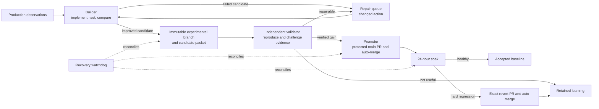

# Autonomous improvement graph

## Status: Autonomous improvement: commissioning

Carl is commissioning a graph-engineered autonomous improvement factory. This page
describes the commissioned flow and its intended safety boundaries. It is not evidence
that all historical commits were autonomous, and it does not claim that current product
promotion is autonomous. The status remains commissioning until a live acceptance
receipt links the exact experimental branch, pull request, production commit, and
accepted soak.

The commissioned flow has no routine human approval: the machine policy, required
checks, independent validation, and bounded credentials decide whether a candidate may
advance. A failure to produce the required evidence fails closed; it does not create an
exception or a broader authority.

## Responsibility graph

The builder can publish only an immutable experimental branch with a complete candidate
packet. Independent validation reproduces the evidence from a clean checkout and runs
protected evaluation outside the candidate worktree. Only a verified gain can become a
protected main pull request; no model receives direct `main` push access. The resulting
merge commit, rather than an assumed PR head, enters the 24-hour soak. A declared hard
regression creates one exact revert for that merge and returns the prior accepted tree.

## Safety boundaries and capability validity

- The builder writes candidate code but cannot grade itself, access protected holdouts,
  change promotion thresholds, alter branch protection, or receive release credentials.
- The independent validator assigns the candidate disposition; the promoter may advance
  only the exact candidate and evidence it validated. A changed commit, base, policy,
  check suite, or receipt invalidates that authority.
- Capability transfer is explicit and evidence-bound: a role receives only the least
  authority needed for its next state, for one exact identity and bounded lifetime.
  Expired, malformed, unsigned, or identity-mismatched capability evidence is invalid.
- Anti-gaming rules keep the candidate separate from its judge: benchmark tasks,
  graders, protected holdouts, reviewer instructions, promotion policy, and rollback
  logic cannot change in the same experiment as product code. Valid failures cannot be
  selectively rerun as successes.
- Automation never force-pushes, directly pushes `main`, weakens a policy for a
  candidate, deploys, or publishes a release. Recovery retries use a changed action;
  otherwise the affected stage freezes and retains its evidence.

## Evidence and public provenance

When live commissioning produces an acceptance receipt, this guide will link its exact
[experimental branches](https://github.com/StephenBickel/carl-agent/branches/all?query=experimental%2F)
and [pull requests](https://github.com/StephenBickel/carl-agent/pulls), along with the
associated production commit and accepted soak. Until then, the approved
[operating-system design](superpowers/specs/2026-08-19-carl-autonomous-improvement-operating-system-design.md)
is the public design reference, not proof of an autonomous promotion.
