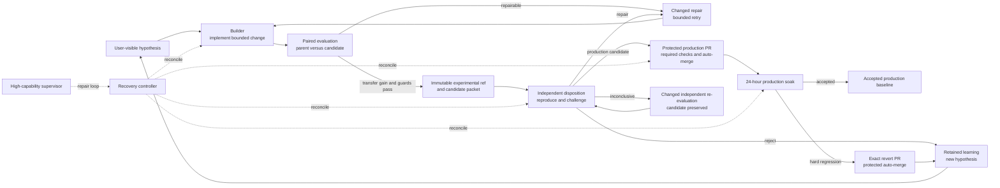

# Autonomous improvement: commissioning

Carl is a self-improving project.

Status: commissioning

This page defines the repository's responsibility graph and safety boundary. The factory remains
in commissioning until a genuine `remote_cloud_acceptance_receipt` proves one complete live cycle.
Experimental changes move through independent validation into protected main, followed by a
24-hour soak and exact revert when required. No routine human approval is required; capability
transfer, not benchmark gaming, is the acceptance target.
Current zero-human operation is not proven and is not claimed. The configured system is intended to
run without routine human approval once commissioned; that authority is not evidence that it has
already done so.

## Responsibility graph

The only successful product path is:

`hypothesis → builder → paired evaluation → immutable experimental → independent disposition → protected production → soak → revert when required → retained learning`

A higher score, a new report, or another watchdog run is not a product outcome. A candidate that
does not improve transferable capability is disposed once, its learning is retained, and the next
cycle must use a new or materially changed hypothesis.

An inconclusive disposition preserves the candidate, blocks promotion, and returns ownership to the
independent validator for one materially different evaluation; it never becomes a pass.

## Role ownership

- The builder alone mutates candidate code. It starts from the exact production parent, writes a
  failing behavioral test, implements one bounded user-visible hypothesis, and runs a paired parent
  and candidate evaluation. It may autonomously push one immutable `experimental/*` ref after the
  experimental gates pass.
- The independent validator cannot mutate the candidate. It reproduces the exact packet from a
  clean checkout, challenges the claimed gain, probes for benchmark gaming, and records exactly one
  disposition: production candidate, repair, reject, or inconclusive.
- The promoter may autonomously open or update a protected production PR, mark it ready, and enable
  auto-merge only for the independently accepted identity. Required checks and branch protection,
  not model judgment, control the merge.
- The soak and rollback controller observes the exact production merge for 24 hours. A hard
  regression starts one exact revert PR within two hours; a healthy soak records acceptance.
- The recovery controller reconciles interrupted effects, stale leases, and changed retries. It
  resumes an existing node and never invents a new candidate or disposition.
- The supervisor uses the strongest configured model to repair control-plane failures, retry the
  exact next safe node, or freeze one unsafe boundary. It cannot weaken gates, edit evidence, mutate
  candidates, or assume another role's authority.
- The outcome monitor and weekly reporter are observers. They count actual branches, dispositions,
  PRs, production commits, accepted soaks, reverts, and retained learning—not controller activity.

## Cloud-heavy execution

Heavy builds, Rust and Python suites, paired evaluations, protected validation, and soak probes run
on isolated cloud runners. The owner's machine is limited to thin control-plane work such as source
selection, bounded edits, Git and GitHub reconciliation, ledger transitions, signatures, and receipt
verification. No controller may silently fall back to a local heavy build, benchmark, Docker, or
soak workload. Unavailable cloud execution preserves the queued node and triggers a bounded changed
retry.

## Autonomous protected authority

Within its configured role, the factory is explicitly authorized to:

- autonomously create commits and push immutable experimental branches;
- independently dispose candidates as accepted for production, repairable, rejected, or
  inconclusive;
- autonomously promote an eligible identity through a protected production PR and auto-merge;
- create and push an exact revert branch and protected revert PR after a hard regression; and
- retain learning, select the next hypothesis, and retry materially changed recovery actions.

That authority never includes a direct `main` push, force-push, required-check or branch-protection
weakening, post-observation evidence edits, candidate access to protected holdouts or signing keys,
deployment, release publication, or silent deletion of evidence-bearing refs. Missing provenance
blocks only the affected disposition or promotion; it never becomes a pass.

## Capability evidence, not benchmark gaming

Every hypothesis states the observable user outcome before metrics are selected. Parent and
candidate use the same model, effort, task set, seeds, metric pack, and environment. Promotion also
requires:

- a held-out or adversarial transfer task outside builder control;
- a novelty check against prior hypotheses, branches, fixes, and retained learning;
- immutable provenance for parent, candidate, tree, harness, task, metric, run, artifact, review,
  and receipt identities;
- task-level outcomes, invalid-attempt disclosure, latency, cost, safety, and non-inferior guards;
- independent reproduction and probes for hard-coded fixtures, test detection, selective retry,
  narrowed inputs, changed defaults, and grader or threshold manipulation; and
- post-merge observations tied to the preregistered capability claim.

Deterministic tests establish correctness contracts but do not alone prove broader capability. A
benchmark-only gain is ineligible unless the benchmark itself is the user-visible defect and an
independent held-out transfer outcome confirms the general improvement.

## Durable outcomes and updates

Each transition records the experiment, prior and next state, exact actor, attempt, authoritative
time, parent and candidate identities, evidence digest, idempotency key, action, and next safe node.
User updates are limited to a concrete pushed, disposed, promoted, soaked, reverted, or frozen
outcome. Every update names its exact identity and authoritative time. Healthy ticks, retries,
diagnoses, and report creation remain durable internal evidence rather than progress announcements.

See [autonomy operations](autonomy-operations.md) for the state, evidence, recovery, and update
runbook.

## Commissioning and live evidence

Operational status requires a valid `remote_cloud_acceptance_receipt` that binds the experimental
ref and commit, independent disposition, protected PR, production merge commit and tree, signed
evidence, and accepted 24-hour soak. Until that receipt exists, all public documents and the live
manifest must say `Status: commissioning`.

When live commissioning succeeds, this page will link the exact
[experimental branches](https://github.com/StephenBickel/carl-agent/branches/all?query=experimental%2F)
and [pull requests](https://github.com/StephenBickel/carl-agent/pulls), production commit, receipt,
and accepted soak. Until then, the approved
[operating-system design](superpowers/specs/2026-08-19-carl-autonomous-improvement-operating-system-design.md)
is the design reference, not proof of current autonomous production operation.
