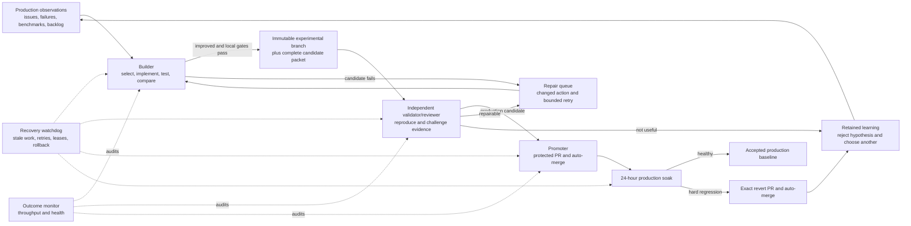

# Carl Autonomous Improvement Operating System Design

Status: approved architecture, pending written-spec review
Date: 2026-08-19
Decision owner: Stephen Bickel

## Outcome

Carl continuously improves without routine human approval. The system observes production,
selects one user-relevant hypothesis, implements it, measures the exact candidate against its
production parent, pushes useful candidates to an immutable experimental branch, independently
reviews them, promotes verified improvements to protected `main`, watches production for 24 hours,
and automatically reverts hard regressions.

A run that only reports a failure is not successful. Every nonterminal failure must produce a
durable retry with a specific changed action, while terminal candidate failures retain learning and
move the factory to a different hypothesis. Monitoring exists to recover work, not to substitute for
work.

## Current failure and correction

The existing prompts deadlock the factory:

- the builder requires protected production validation before publishing an experimental candidate;
- the production reviewer requires a published experimental candidate before it validates one;
- the builder prioritizes unfinished constitutional infrastructure over product improvements;
- proposal review can end a run before implementation without scheduling a changed repair;
- the two-hour watchdog repeatedly reports the same missing infrastructure despite having no active
  promotion to reconcile;
- success is measured by fresh reports and safe rejection rather than product throughput.

The correction separates experimental publication from production promotion, makes progress a
durable state machine, and makes every automation responsible for advancing only its own states.

## Responsibility graph



## Automation portfolio

### 1. Autonomous product builder

Replaces the current daily self-improvement graph as the only product mutation owner.

- Runs from the exact current `origin/main` and fetches remote state first.
- Selects one bounded hypothesis from observed product behavior, open defects, compatibility gaps,
  missing user capabilities, or a durable prioritized backlog.
- Never selects factory infrastructure while an eligible product hypothesis exists. Infrastructure
  work has its own backlog and cannot consume the product lane repeatedly.
- Establishes a current baseline, writes a failing test, implements the smallest general fix or
  feature, and reruns deterministic tests plus relevant behavioral evaluations.
- Uses the same model, effort, task set, metric pack, seeds, and environment for paired comparisons.
- May repair a candidate twice in the same cycle when evidence identifies a concrete code defect.
- Pushes exactly one immutable `experimental/<experiment-id>` branch when local tests, paired
  evaluation, guards, independent code review, and security review pass. Protected production
  validation is not required for experimental publication.
- Records a complete candidate packet containing exact commits and trees, commands, results,
  invalid attempts, deltas, cost, latency, reviews, security findings, and rollback trigger.
- If the candidate remains worse after repair, records retained learning, terminalizes that
  hypothesis, and queues a different product hypothesis for the next cycle.

### 2. Independent validator and production promoter

Replaces the current passive daily production review.

- Runs after the builder window and also discovers unreviewed immutable experimental branches.
- Reviews each exact candidate once, reproduces all mandatory evidence from a clean checkout, and
  runs protected validation outside the candidate worktree.
- A valid improvement opens or reconciles a PR to `main`, marks it ready, and enables auto-merge
  after required checks pass. Routine promotion needs no human approval.
- A repairable failure creates a durable repair request identifying the failed gate and changed
  action, then returns ownership to the builder.
- A nonrepairable or non-improving candidate is rejected with retained learning and cannot be
  reviewed again unchanged.
- It never directly pushes `main`, changes branch protection for a candidate, force-pushes,
  deploys, or releases.

### 3. Recovery and rollback controller

Replaces the noisy two-hour watchdog with an event-focused recovery controller.

- Runs frequently only while an experiment, review, promotion, soak, revert, or retry is active.
- When idle, performs one compact health check and exits without generating repetitive narratives.
- Resumes interrupted work from the exact durable state; it does not start new product hypotheses.
- Retries infrastructure failures up to three times with bounded backoff and a changed recovery
  action. Repeating the same command against unchanged state is forbidden.
- Reconciles stale leases, duplicate effects, exact PR/head/base identities, required checks,
  auto-merge, merge trees, soak observations, and exact revert PRs.
- A hard production regression starts an exact checked revert within two hours.
- If recovery cannot progress after three materially different attempts, it freezes only the unsafe
  stage, records the required infrastructure repair, and leaves the product builder free to publish
  experimental candidates.

### 4. Outcome monitor

- Audits throughput once daily; it never performs ordinary product or promotion work.
- Treats zero experimental candidates over two consecutive builder cycles as critical.
- Treats repetitive identical failures, unchanged retry actions, and report-only runs as stuck work.
- Reports counts of hypotheses, implemented candidates, experimental pushes, reviews, promotions,
  accepted soaks, reverts, and retained learnings.
- Produces one concise progress item; watchdog run count is not a success metric.

### 5. Weekly product report

- Summarizes user-visible experimental and production changes, evidence, commits, PRs, soaks,
  reverts, and next hypotheses.
- Omits repetitive controller ticks unless they represent an incident or recovery.

## Durable state and ownership

Each experiment has one append-only record and one current state:

```text
queued -> baselining -> implementing -> evaluating -> experimental
experimental -> validating -> production_candidate -> promoting -> soaking -> accepted
implementing/evaluating/validating -> repairing -> implementing
implementing/evaluating/validating -> rejected -> learned -> queued(new hypothesis)
soaking -> reverting -> reverted -> learned -> queued(new hypothesis)
```

Every transition records the experiment ID, prior and next state, exact actor, attempt number,
timestamp, parent and candidate identities when applicable, evidence digest, action taken, and next
action. Consequential effects have idempotency keys. Only the builder mutates candidate code; only
the validator assigns disposition; only the promoter mutates PR promotion state; only the recovery
controller reconciles interrupted consequential effects.

## Retry and anti-stall policy

- Candidate code failure: at most two repairs using the failed evidence; each repair must change
  code or test based on a named finding.
- Proposal objection: revise once if locally solvable, then choose a different product hypothesis.
  Proposal review cannot redirect the product lane into constitutional infrastructure.
- Evaluation noise: rerun only preregistered invalid trials; never rerun valid failures selectively.
- Infrastructure failure: three retries with changed actions and bounded backoff. Then preserve the
  candidate experimentally and freeze only the blocked promotion stage.
- Two consecutive builder cycles without an experimental candidate force a different hypothesis
  and trigger a critical outcome alert.
- The same blocker may not be the primary work item for more than two cycles unless new evidence or
  newly provisioned capability changes the action.

## Autonomous authority

The automations are explicitly authorized to:

- create commits and immutable `experimental/*` branches;
- push experimental branches to `StephenBickel/carl-agent`;
- open and update PRs from experimental branches to `main`;
- mark eligible PRs ready and enable auto-merge without human approval;
- create and push exact revert branches and PRs after hard regressions;
- retry, repair, reject, retain learning, and select the next hypothesis automatically.

They are not authorized to directly push or rewrite `main`, force-push, weaken required checks or
branch protection, edit evidence after observation, expose signing secrets to candidate execution,
deploy, publish releases, or delete evidence-bearing branches silently.

## Evidence and promotion decision

Experimental publication requires:

- exact clean parent and candidate identities;
- deterministic tests and relevant full repository gates;
- a preregistered paired behavioral comparison;
- no guard regression or hidden invalid trials;
- independent code review and security review;
- a complete durable candidate packet.

Production promotion additionally requires:

- independent reproduction from a clean checkout;
- protected validation isolated from candidate credentials and evidence mutation;
- a positive primary metric or a clearly preregistered correctness/compatibility improvement with
  non-inferior guards;
- all protected GitHub checks passing against current `main`;
- exact PR head, base, commit, and tree reconciliation;
- an available rollback target and active serialized promotion ownership.

## Verification before activation

The redesign is not considered working merely because prompts were updated. Activation requires a
synthetic end-to-end exercise in a non-production fixture followed by one bounded real product
experiment.

The synthetic exercise must prove:

1. the builder creates a candidate and immutable experimental branch;
2. the validator detects both a valid improvement and tampered evidence;
3. the promoter opens a PR and enables auto-merge only for the valid candidate;
4. restart recovery resumes each consequential state without duplicate branches or PRs;
5. a healthy merge completes the soak and becomes accepted;
6. an injected hard regression creates one exact revert PR and restores the preceding tree;
7. stale leases and infrastructure failures schedule changed retry actions;
8. idle watchdog ticks do not create repeated progress reports.

The first live acceptance criterion is one real, user-relevant Carl improvement that moves through
baseline, implementation, paired evaluation, experimental push, independent review, protected PR,
merge, and soak without human intervention. Until that succeeds, the outcome monitor reports the
factory as commissioning rather than healthy.

## Rollout

1. Rewrite all five automation prompts around these responsibilities and remove the publication
   deadlock.
2. Reduce idle watchdog reporting and make recovery conditional on active durable work.
3. Add durable retry and throughput fields required by the state machine.
4. Run focused contract tests for prompt invariants and deterministic controller logic.
5. Run the synthetic lifecycle and repair every failed stage.
6. Dispatch one bounded real product experiment and follow it through GitHub and soak.
7. Declare the factory healthy only after the live acceptance criterion passes.
