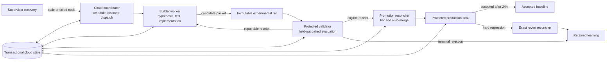

# Carl Autonomy Activation Bridge Design

Status: proposed for implementation review
Date: 2026-08-20
Decision owner: Stephen Bickel
Supersedes: activation details, but not policy, in the approved autonomous improvement operating-system design

## Outcome

Carl's improvement loop runs in cloud infrastructure, advances durable state, implements user-visible
hypotheses, publishes immutable experimental candidates, independently evaluates exact parent and
candidate pairs, promotes eligible candidates through protected GitHub pull requests, observes the
production merge for 24 hours, and creates an exact revert when a hard regression is detected.

Routine execution requires no human approval. A run is successful only if it advances one durable
state, proves that the current state is terminal, or performs a materially changed bounded recovery
action. A watchdog report, fresh timestamp, or repeated diagnosis is not progress.

This design activates the strong contracts already present in the repository. It does not replace
the existing immutable publication, protected evidence, retry, lease, promotion, soak, revert, and
commissioning code. It supplies the missing scheduler, remote model worker, durable cloud state,
protected input delivery, live capability evaluator, and GitHub effect executor around those
contracts.

## Verified starting point

At protected `main` commit `6fdce1b73b45980285e19f138dbfdd5312c441ef`:

- `autonomous-improvement.yml` and `autonomous-soak.yml` accept content-addressed requests and bind
  exact workflow, parent, candidate, input, binary, run, and artifact identities.
- `cloud_execution.py` defines deterministic dispatch/reconciliation, signed observations, bounded
  infrastructure retries, and compare-and-swap retry state.
- `experimental_publication.py` permits one immutable `experimental/<experiment-id>` ref and rejects
  conflicting rewrites.
- the experiment ledger and autonomy reducer provide append-only, hash-chained experiment facts and
  distinguish trusted-authority events.
- the GitHub promotion controller reconciles exact PR, required-check, merge-tree, soak, and revert
  identities without permitting direct `main` updates.
- the commissioning verifier requires an exact experimental ref, PR, production merge, and accepted
  24-hour soak before public operational status is valid.
- the benchmark contract suite passes: 518 tests.

The system is not activated because both autonomous workflows are dispatch-only, protected input
objects are absent, retry and experiment ledgers are owner-local files, no remote model builder is
connected, and `cloud_harness.py` intentionally forces every result to `insufficient_evidence` with
`live_acp_credential_missing`.

## Responsibility and authority graph



The identities are deliberately separate:

- The coordinator may read repository and state facts and dispatch exact requests. It cannot grade,
  alter candidates, or update `main`.
- The builder may call the model, edit a candidate checkout, commit, and create exactly one immutable
  experimental branch. It cannot access held-out inputs, evaluator credentials, promotion tokens,
  or state history unrelated to its packet.
- The validator owns task selection, held-out execution, and disposition. It receives read-only
  subjects and cannot mutate candidate code or GitHub promotion state.
- The promotion reconciler receives only a validated exact candidate receipt. Its GitHub App token
  can create/update PRs, enable auto-merge, and create an exact revert branch/PR. Branch protection
  prevents direct `main` updates.
- The supervisor can repair control-plane code through the same branch/PR process and redispatch a
  safe node. It cannot fabricate evidence, change a disposition, or bypass a gate.

## Cloud runtime and scheduling

GitHub-hosted Actions are the initial cloud runtime. The owner's Mac is not an executor or source of
truth. Four protected workflows run from the default branch:

1. `autonomy-coordinator.yml` runs every two hours and by manual dispatch. It reconstructs the
   current state, acquires one compare-and-swap lease, and dispatches the exact next safe node.
2. `autonomy-builder.yml` runs daily when no product experiment is active, and on a repair request.
   It selects and implements one bounded user-visible hypothesis, runs deterministic candidate
   gates, and publishes an experimental candidate or retained learning.
3. The existing improvement and soak workflows perform protected validation and observation after
   being extended with private input retrieval and live capability execution.
4. `autonomy-supervisor.yml` runs after a critical monitor finding, bounded retry exhaustion, or a
   daily commissioning check while status is not operational. It must commit a changed recovery
   action or record a precise frozen boundary.

GitHub schedule delivery is treated as at-least-once and potentially delayed. Correctness comes
from request digests, effect keys, leases, and compare-and-swap state—not from assuming one cron
invocation. Every workflow also supports `workflow_dispatch` so the coordinator can recover a
missed event without changing the request identity.

Each heavy build, Rust/Python suite, paired evaluation, soak probe, and model invocation runs on a
cloud runner with explicit timeout and cost limits. No workflow falls back to local Cargo, pytest,
Docker, benchmark, or soak execution.

## Durable cloud state

The operational source of truth is a managed PostgreSQL database reached through role-scoped
transactional procedures. Workflow memory, local files, caches, GitHub Actions artifacts, issue
comments, and mutable Git branches are not state authorities.

The minimum schema contains:

```text
experiment_manifests
experiment_events
leases
supervisor_triggers
commands
evidence_objects
monitor_snapshots
```

`experiment_events` preserves the existing unique stage-attempt ID, experiment ordinal, event
digest, previous chain digest, chain digest, authority, and provenance. `commands` stores one exact
external effect request, deterministic idempotency key, fixed occurrence timestamp, state revision,
status, retry plan, and resulting remote identity. Persisting the timestamp before execution ensures
that a lost response and replay cannot create the same attempt ID with a different event digest.

Each coordinator cycle reads current GitHub truth, transactionally claims one command by revision,
executes or reconciles the external effect, then atomically appends the resulting fact, completes the
command, and updates/releases the lease. Duplicate keys with identical canonical content replay
idempotently. A conflicting payload, event chain, result identity, revision, or authority is a
critical integrity failure.

Database roles enforce authority at the procedure boundary: builder may register manifests and
candidate facts; validator may append dispositions and protected evidence; promoter may record exact
GitHub effects; soak/revert may record production observations; supervisor may claim and resolve
recovery triggers but cannot append protected validation or promotion evidence. Candidate processes
receive no database credential.

Canonical receipts and bounded evidence payloads are copied to a versioned, retention-locked object
store and addressed by SHA-256. Database rows contain digest, immutable object version, producer,
request identity, and retention metadata. GitHub workflow artifacts remain short-lived transport,
not durable evidence, because they expire.

The existing SQLite ledger, commissioning effect store, supervisor-trigger store, and JSON retry
store remain reference implementations and unit-test oracles. A `StateBackend` boundary maps their
register, append, claim, resolve, projection, initialize, and compare-and-swap behavior to
PostgreSQL. Database migrations and local container tests are repository code; production
provisioning and credentials are infrastructure configuration.

### Approaches considered

- A protected orphan Git state branch offers simple durability and ref-level compare-and-swap, but
  cannot enforce role-specific event authority, atomically claim commands with leases and events, or
  efficiently query throughput as the ledger grows.
- A hosted workflow engine provides timers and retries, but duplicates the repository's tested state
  machine and still requires a transactional evidence/lease authority.
- Managed PostgreSQL plus immutable object storage is selected because it preserves the existing
  event contracts, supports transactional CAS and role-scoped procedures, survives runner loss, and
  leaves GitHub authoritative for GitHub facts.

The cloud vendor is deployment configuration, not promotion policy. The implementation supplies a
portable PostgreSQL schema, OIDC role contract, object-store interface, and one fully tested provider
profile. A different provider may replace that profile only if it passes the same commissioning
suite.

## Credentials and secret isolation

Two nonhuman external-effect credentials are required:

- an OpenAI project service-account key with a project budget and rate limits for builder and live
  validator calls;
- a narrowly scoped GitHub App installation token for experimental publication, PR
  reconciliation, auto-merge, and exact revert PRs.

Credentials are stored in GitHub Environments, never in the repository, database, artifacts, or
candidate process environment. The environments are separated:

- `carl-autonomy-builder` exposes only the model credential and experimental-publication identity;
- `carl-autonomy-validator` exposes the model credential and private holdout reader;
- `carl-autonomy-promoter` exposes only the promotion GitHub App identity;
- `carl-autonomy-soak` exposes only health-observation inputs and exact-revert identity.

Environment access is restricted to workflows at protected `main`. No human reviewer is configured,
so routine progress remains autonomous. Jobs mint short-lived GitHub App tokens. The long-lived
OpenAI key is passed only to a controller-owned model gateway process; candidate binaries and
candidate-generated commands receive a closed environment with no secret values.

If an OIDC-compatible secret manager is available, the same environments exchange GitHub's OIDC
identity for short-lived secret access and stop storing provider secrets in GitHub. The workflow
contract accepts either source but exposes the same sealed model gateway interface. Missing or
mis-scoped credentials fail the affected stage closed, preserve experimental work, and trigger a
changed recovery attempt; they never weaken evaluation.

Database, object-store, and signing access always uses GitHub OIDC federation and short-lived cloud
roles. The protected observer signs verified run observations and commissioning receipts with a
non-exportable asymmetric key in cloud KMS; workflows receive signing operations, never private key
bytes. The repository contains only the pinned verification key and key identifier.

## Activation bridge components and wire contracts

The implementation adds the concrete adapters currently missing between pure reconciliation code
and GitHub/cloud effects:

- strict canonical codecs for cloud requests, snapshots, decisions, signed observations, receipts,
  commands, and results;
- a GitHub dispatcher that invokes a workflow at the exact protected revision, sends request and
  attempt keys, discovers the accepted run, and closes the crash window by persisting the command
  before dispatch;
- a run observer that queries GitHub independently, verifies run/workflow/head/artifact identities,
  hashes downloaded bytes, validates evidence schema, archives immutable evidence, and signs the
  resulting observation;
- autonomy ingestion that converts verified `record_success` results into trusted ledger events,
  dispositions, promotion authority, soak scheduling, and live commissioning facts;
- a cloud state client implementing transactional command claim, lease, append, resolution, and
  projection operations;
- a live commissioning artifact type that cannot be minted by synthetic commissioning fixtures.

The observer is separate from the evaluated workflow. GitHub metadata and uploaded artifacts are
untrusted until the observer independently verifies and signs them. Local synthetic signing keys and
effect stores are never accepted for remote-cloud or production receipts.

Acceptance after a healthy 24-hour soak is appended as an explicit durable state-transition event.
It is not inferred only from an in-memory projection. Every replayed controller command reuses the
occurrence timestamp persisted before its first external attempt.

## Immutable inputs and anti-gaming

Public descriptors and private held-out payloads are separated.

- The protected default branch contains canonical experiment declarations, public regression tasks,
  metric schemas, policy, and SHA-256 commitments for every private object.
- A private content-addressed object store contains held-out task archives, adversarial variants,
  grader configuration, and transfer checks. The validator fetches an object only by a digest already
  committed in the protected descriptor and verifies its bytes before use.
- The builder sees behavior goals, public tests, constraints, and the private object digests, but not
  held-out bytes or grader outputs beyond a bounded disposition/repair receipt.
- Active evaluator, policy, workflow, and input revisions are bound to the candidate's production
  parent. A candidate that modifies these files is evaluated by the protected parent versions and is
  ineligible for product promotion in the same experiment.

The input registry defines media type and schema for each object. Improvement task sets are canonical
JSON contracts; soak task sets are safe canonical archives with normalized paths, modes, ownership,
ordering, and timestamps. They use distinct media-type/version identifiers, resolving the current
conflict where one `task-set` name is parsed as JSON by improvement but extracted as a tar archive by
soak. Soak experiment, metric, and policy inputs must actively govern the health result; merely
hashing unused files is not sufficient evidence.

Every product hypothesis preregisters a user-observable capability, affected behaviors, guards,
transfer family, maximum trials, retry policy, cost/latency bounds, and rollback trigger before the
candidate is generated. Promotion requires:

- deterministic repository checks;
- a paired parent/candidate comparison under identical model, effort, seeds, tools, and limits;
- improvement on the affected behavior;
- no guard, safety, or held-out transfer regression;
- no hard-coded fixtures, task detection, selective retry, narrowed inputs, or evaluator changes;
- an independent validator disposition bound to exact commits, trees, inputs, workflow, and result.

An aggregate score cannot hide task-level regressions. Valid failures are retained and cannot be
rerun selectively. Repeated score gains without held-out transfer gains are recorded as benchmark
gaming, terminalize the hypothesis, and force selection from a different product capability family.

## Live capability evaluator

The current deterministic `cloud_harness.py` remains the wiring and repository-contract evaluator.
A new protected live adapter supplies the missing capability evidence instead of changing the
existing result after the fact.

The adapter executes preregistered tasks against exact parent and candidate binaries through a
controller-owned ACP/model gateway. It records bounded task observations, model/effort identifiers,
tool protocol revision, seeds, token/cost/latency values, invalid-trial classifications, and sealed
grader outcomes. Parent and candidate run in separate unprivileged identities and never receive the
model or grader credential.

The final evidence combiner accepts exactly one deterministic result and one live result with
matching request, subject, workflow, and immutable-input identities. It computes eligibility from
protected policy. `live_acp_credential_missing` remains the fail-closed result when the adapter did
not run; no caller may flip `eligible` or edit reasons in an artifact.

The same adapter supports soak mode against the exact two-parent production merge, with a health
task set and stricter regression policy. Soak evidence is observational and cannot retroactively
make an ineligible candidate promotable.

## Builder loop

The builder is a stateful worker, not a prompt-only daily report:

1. Reconstruct current accepted baseline, retained learnings, open defects, and capability-family
   cooldowns from durable state and GitHub.
2. Select one new user-visible hypothesis. It may not choose factory infrastructure while an eligible
   product hypothesis exists.
3. Create a clean branch from exact `origin/main`, preregister the experiment, and write a failing
   behavioral test before implementation.
4. Let the model worker edit only the declared candidate paths in a sandboxed checkout.
5. Run targeted tests, complete repository checks, code review, security review, and public paired
   probes. Heavy work remains on GitHub-hosted runners.
6. Repair at most twice when a named finding supports a changed code/test action.
7. If the candidate is coherent and locally eligible, create its packet and publish one immutable
   `experimental/<experiment-id>` branch without waiting for live production validation.
8. If it remains worse or invalid, record retained learning and select a different hypothesis family
   on the next cycle.

Experimental publication and production promotion are intentionally decoupled. A missing validator
credential or private holdout cannot prevent useful candidates from reaching the experimental lane.
The current publication dependency on promotion-grade `CapabilityValidationReport` is replaced with
a narrow `ExperimentalPublicationEligibility` receipt: exact candidate commit/tree, sealed packet
digest, deterministic checks, review results, and local experimental gates. Live ACP evidence remains
mandatory for independent disposition and production promotion only.

## Validation, promotion, soak, and rollback

The coordinator discovers each unreviewed immutable experimental ref and dispatches exactly one
protected validation request. The validator verifies the packet, independently reviews the diff,
runs public and private paired evaluation from the protected parent, and emits one disposition:

- `production_candidate`: exact validation receipt is eligible;
- `repair_requested`: bounded findings and changed action return ownership to the builder;
- `rejected`: terminal evidence and retained learning prevent identical reevaluation;
- `inconclusive`: infrastructure/noise reason schedules only preregistered bounded retries.

For `production_candidate`, the promoter creates or reconciles a PR from the immutable experimental
branch to `main`, verifies the exact head/tree/base and required checks, marks it ready, and enables
auto-merge. It never directly updates `main`. Because pushes and PRs performed with the default
`GITHUB_TOKEN` do not reliably trigger all downstream workflow events, consequential GitHub effects
use the installation token of the dedicated GitHub App.

After merge, the exact merge commit and tree enter soak. Protected observations occur at least every
six hours and once after 24 hours. A healthy observation at or beyond 24 hours records acceptance.
A hard regression immediately acquires the revert lane, creates the exact checked revert branch/PR,
and starts required checks. The monitor reports critical if revert creation has not started within
two hours. Soft or ambiguous degradation schedules a changed diagnostic observation without
rewriting production history.

## Recovery and supervisor behavior

The coordinator classifies failures before retrying:

- infrastructure failures receive up to three retries with bounded backoff and a distinct action;
- invalid evidence, identity mismatch, policy failure, and capability regression are candidate
  outcomes, not infrastructure retries;
- an expired lease is reconciled from remote effects before it is renewed or cleared;
- a repeated identical action against unchanged state is rejected as `stuck_recovery`;
- retry exhaustion freezes only the unsafe node and leaves builder/experimental throughput active.

The supervisor uses the strongest configured coding model and highest supported reasoning effort.
It reconstructs facts from transactional state, GitHub refs/PRs/checks/runs/artifacts, and protected
receipts. A successful supervisor run must produce one of: a control-plane repair PR, a reconciled
state transition, a redispatched exact safe node with a changed action, or a precise frozen boundary
whose missing capability cannot be synthesized. It may not merely append another diagnosis.

## Health, throughput, and progress reports

The daily outcome monitor runs the deterministic promotion-health evaluator and reports exact UTC
times for the last successful builder outcome, independent disposition, promotion, soak observation,
accepted soak, revert, coordinator transition, and supervisor recovery.

Since the prior audit it reports counts of:

- new user-visible hypotheses;
- implemented experiments;
- immutable experimental candidates;
- validator dispositions by outcome;
- production PRs and promotions;
- accepted soaks and reverts;
- retained learnings and benchmark-gaming rejections;
- infrastructure retries, changed recovery actions, and exhausted stages.

Critical thresholds remain: daily builder/review older than 36 hours, coordinator/watchdog older
than four hours, expired unreconciled lease, incomplete/invalid promotion evidence, soak observation
older than 26 hours, hard failure without revert start within two hours, protection drift, or worse
production without active rollback. Two consecutive builder cycles with no experimental candidate
are also critical unless both ended in distinct, productive, retained-learning rejections.

User updates contain only what changed: experimental branch and hypothesis, validator disposition,
production PR/commit, soak/revert state, blockers, automatic recovery performed, and next expected
outcome. Routine healthy controller ticks do not create progress messages.

## Commissioning sequence

Activation is delivered in bounded stages, each with a durable receipt:

1. Provision the managed database, immutable evidence bucket, KMS signing key, and role-scoped OIDC
   identities; prove concurrent append, idempotent replay, conflict rejection, lease expiry
   reconciliation, authority denial, and restart recovery.
2. Add scheduled coordinator, builder, and supervisor workflows with closed permissions, concurrency,
   timeouts, budgets, and exact dispatch contracts.
3. Publish a signed public commissioning input pack and populate the private held-out object store;
   prove digest mismatch and candidate-access attempts fail closed.
4. Connect the OpenAI project service account and GitHub App through separated environments; prove
   secrets are absent from candidate environments, logs, artifacts, and state.
5. Run a synthetic canary candidate through model build, immutable experimental publication,
   protected live validation, PR/check/auto-merge reconciliation, simulated hard failure, and exact
   revert in a nonproduction commissioning fixture.
6. Run one real user-visible experiment from current `main`. Require an immutable experimental ref,
   independent disposition, protected production PR/merge when eligible, and 24-hour accepted soak.
7. Emit the existing live acceptance receipt and only then change public status from commissioning
   to operational.

Synthetic canaries prove wiring, identity, and recovery but never count as product throughput or
production capability improvement.

## Failure boundaries

The loop must stop a specific consequential stage when any of these are true:

- branch protection or required checks drift;
- state-chain or receipt integrity fails;
- protected workflow/input identity cannot be proven;
- a secret reaches a candidate process or artifact;
- the exact production target is ambiguous;
- a hard regression exists and exact revert safety cannot be proven.

Stopping promotion does not stop safe product hypothesis generation or immutable experimental
publication. No recovery may weaken a gate, edit candidate evidence, force-push, directly push
`main`, deploy, release, or silently delete evidence-bearing branches.

## Implementation boundaries

The activation bridge changes control-plane code, tests, workflows, fixtures, and documentation. It
does not broaden Carl's product runtime privileges, add a production deployment system, publish a
release, or make historical commits appear autonomous. Existing public commissioning language stays
in place until the live acceptance receipt exists.

Implementation is complete only when the cloud coordinator advances a real experiment without the
owner's Mac, an eligible candidate can be independently promoted through protected GitHub controls,
an ineligible candidate is retained and followed by a different hypothesis, interrupted cloud work
recovers from durable state, and the first production merge finishes its 24-hour soak or exact
rollback.
